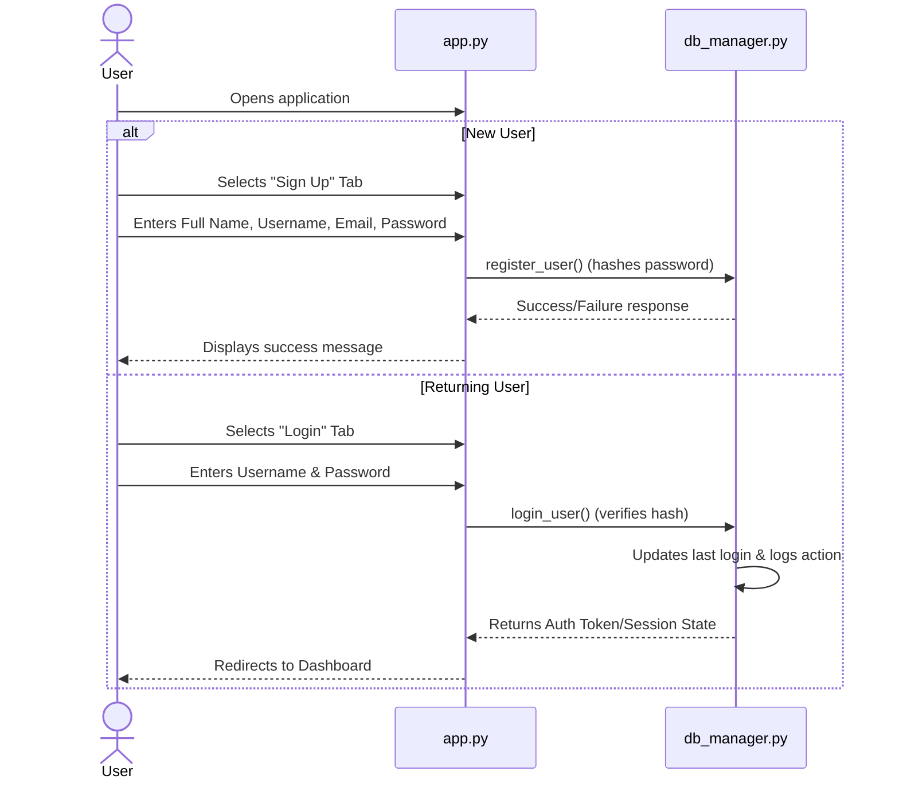
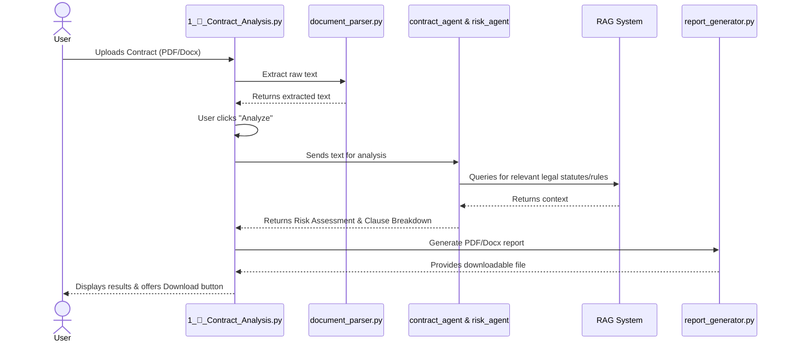
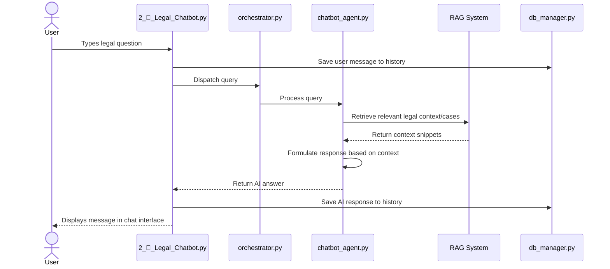

# User Functional Areas - Step-by-Step Flow

This document details the functional step-by-step journeys a user takes while interacting with the different core areas of the AI Legal Consultation Platform.

---

## 1. Authentication & Onboarding Flow

**Goal:** Securely access the platform and initialize user settings.

**Step-by-Step:**
1. User navigates to the platform URL.
2. If unauthenticated, the user is presented with the "Login" and "Sign Up" tabs.
3. **Registration:** User provides details; the system hashes the password using `bcrypt`, stores it in SQLite, and prompts the user to log in.
4. **Login:** User provides credentials; the system verifies them, initializes the `st.session_state` with user details (ID, role, default jurisdiction), logs the action, and redirects to the Main Dashboard.

---

## 2. Dashboard & Navigation Flow

**Goal:** Provide an overview and easy access to platform features.

**Step-by-Step:**
1. Upon successful login, the user lands on the **Dashboard** (`show_main_page` in `app.py`).
2. The user sees a welcome message and a summary of their personal analytics (total documents, analyses, chats, summaries fetched from the DB).
3. The sidebar populates with navigation links to the different functional pages (`1_📄_Contract_Analysis`, `2_🤖_Legal_Chatbot`, etc.).
4. The user clicks a feature card or sidebar link to route to a specific tool.

---

## 3. Contract Analysis Flow

**Goal:** Upload a legal contract and receive an automated, AI-driven risk assessment and clause breakdown.

**Step-by-Step:**
1. User navigates to **Contract Analysis**.
2. User uploads a file (PDF, DOCX, TXT).
3. The `document_parser` extracts raw text from the file.
4. The user clicks "Analyze Contract".
5. The `contract_agent` and `risk_agent` process the text, leveraging the `RAG System` to cross-reference with legal statutes and jurisdiction rules.
6. The UI displays categorized risks (High, Medium, Low), missing clauses, and recommendations.
7. The system uses `report_generator` to compile the findings into a downloadable format, which the user can save.
8. The action is logged to the user's history in the database.

---

## 4. Legal Chatbot Flow

**Goal:** Ask legal questions and receive accurate, cited, and jurisdiction-aware answers.

**Step-by-Step:**
1. User navigates to **Legal Chatbot**.
2. The UI loads the previous conversation history from the database.
3. User types a question (e.g., "Are non-competes enforceable in California?").
4. The query is sent to the `orchestrator`/`chatbot_agent`.
5. The agent uses the `RAG System` to search the vector database (`vector_store.py`) for relevant knowledge base entries.
6. The agent synthesizes the retrieved context and formulates a legally sound answer.
7. (Optional) The `validation_agent` reviews the answer for disclaimers and accuracy before finalizing.
8. The answer is displayed in the chat UI and both the query and answer are saved to the database.

---

## 5. Document Summary Flow

**Goal:** Condense lengthy legal documents into plain-language summaries with actionable items.

**Step-by-Step:**
1. User navigates to **Document Summary**.
2. User uploads a lengthy legal document.
3. The `document_parser` extracts the text.
4. User selects the desired summary format (e.g., "Executive Summary", "Bullet Points", "Key Action Items").
5. The text is passed to the `summary_agent`.
6. The agent processes the text (potentially chunking it if it's too long) and generates the summary.
7. The `text_processor` formats the output cleanly.
8. The UI displays the plain-language summary to the user.
9. The user can copy the summary or download it.

---

## 6. Settings & Analytics Flow

**Goal:** Manage account preferences and view past interactions.

**Step-by-Step:**
1. User navigates to the **Dashboard/Analytics** page to view their historical usage charts (generated from the database logs).
2. User navigates to the **Settings** page.
3. User updates their **Default Jurisdiction** (e.g., changing from "General" to "New York").
4. User can update their profile information or change their password.
5. The UI sends updates to the database via `db_manager.py`.
6. Changes instantly reflect in how the RAG system scopes future context for that user.
